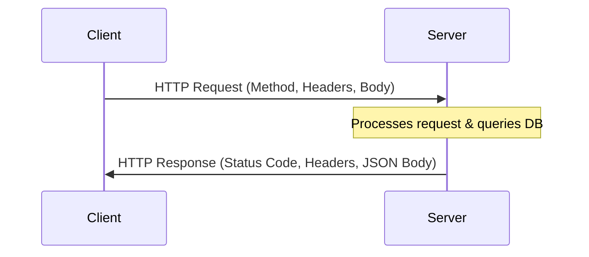
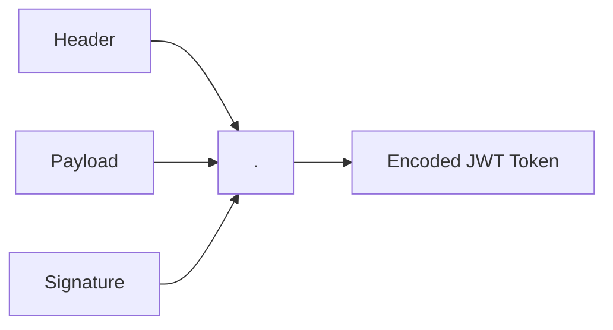
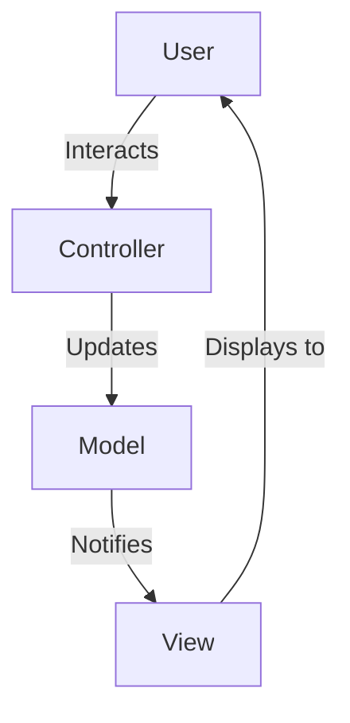

# API & Backend Interview Guide (Accenture Preparation)

This guide covers the **10 API & Backend topics** from your preparation screenshot, followed by **6 additional high-yield backend concepts** commonly tested in web development rounds.

Each concept contains:
1.  **A Clear Definition & Concept**
2.  **Code / API Request Example**
3.  **"How to Say It in the Interview" Script**

---

# Part 1: The 10 Questions From the Image

## 1. What is REST API?
REST stands for **Representational State Transfer**. It is an architectural style for designing networked applications (APIs) that communicate over the **HTTP protocol**. 

### 6 Core Constraints of REST
1.  **Statelessness:** Each request from a client must contain all the information needed to understand and process it. The server stores no client context.
2.  **Client-Server Architecture:** Separates user interface concerns (client) from data storage concerns (server).
3.  **Cacheability:** Responses must define themselves as cacheable or not to improve efficiency.
4.  **Uniform Interface:** Simple, standardized URIs (URLs) and HTTP methods (`GET`, `POST`, etc.).
5.  **Layered System:** A client cannot tell whether it is connected directly to the end server or an intermediate proxy/load balancer.
6.  **Code on Demand (Optional):** Servers can temporarily extend client functionality by sending executable code (like JavaScript).

> [!TIP]
> **How to explain to the interviewer:**
> *"A REST API is an architectural style for web services that relies on the stateless, client-server HTTP protocol. It uses standard HTTP methods—like GET, POST, PUT, and DELETE—to perform CRUD operations on resources identified by URIs. The server does not store any client session state, meaning each request must be self-contained."*

---

## 2. Difference Between GET and POST

### Quick Comparison

| Feature | GET | POST |
| :--- | :--- | :--- |
| **Purpose** | **Retrieves** data from the server. | **Sends** data to the server to create a resource. |
| **Data Location** | Appended to the URL (as Query Parameters). | Sent inside the **HTTP Request Body**. |
| **Security** | Low (sensitive data like passwords visible in URL/browser logs). | Higher (data hidden in the body, though still needs HTTPS encryption). |
| **Cacheability** | Yes, browser caches GET responses. | No, POST responses are not cached. |
| **Idempotency** | **Idempotent** (Calling it 10 times gives the same result). | **Non-Idempotent** (Calling it 10 times creates 10 duplicate records). |
| **Safe Method** | Yes (Does not modify server database). | No (Modifies/mutates database records). |

### Code Example
```http
# GET Request
GET /api/users?status=active HTTP/1.1
Host: api.example.com

# POST Request
POST /api/users HTTP/1.1
Host: api.example.com
Content-Type: application/json

{
  "name": "Amit",
  "email": "amit@accenture.com"
}
```

> [!TIP]
> **How to explain to the interviewer:**
> *"The primary difference is their purpose and data location. GET is a safe, idempotent method used to fetch data, sending parameters inside the URL query string. POST is a non-idempotent method used to submit data to the server to create a new resource, sending parameters securely inside the request body."*

---

## 3. PUT vs. PATCH

### Quick Comparison

| Feature | PUT | PATCH |
| :--- | :--- | :--- |
| **Update Type** | **Full update** (Replaces the entire resource). | **Partial update** (Modifies only the provided fields). |
| **Payload Size** | Larger (must send all resource fields, even unchanged ones). | Smaller (send only the fields you want to change). |
| **Idempotency** | **Idempotent** (Replacing a resource multiple times leaves it in the same state). | **Non-Idempotent** (Can be non-idempotent depending on implementation, e.g., appending values). |

### Code Example
Say a user resource has `{"id": 1, "name": "Amit", "role": "Developer"}`:
```json
// PUT Request to /users/1 (Requires full object)
{"name": "Amit", "role": "Lead Developer"} 
// Result: Role updated.

// If you forget "name" in PUT:
{"role": "Lead Developer"} 
// Result: name is erased or set to null!

// PATCH Request to /users/1 (Requires only modified fields)
{"role": "Lead Developer"} 
// Result: Only role is updated. Name remains "Amit".
```

> [!TIP]
> **How to explain to the interviewer:**
> *"PUT is used for full updates; it completely replaces the target resource with the new payload. If any fields are missing in the request, PUT will overwrite them as null or default values. PATCH is used for partial updates, modifying only the specific fields passed in the request body, leaving other data intact."*

---

## 4. DELETE Method
The `DELETE` HTTP method is used to remove a specific resource identified by a URI.

### Features
*   **Idempotent:** Calling DELETE multiple times on the same resource ID should have the same effect on the server (it stays deleted). The first call deletes it (returning `200 OK` or `204 No Content`); subsequent calls might return `404 Not Found`, but the database state remains unchanged.
*   **Response Codes:** Typically returns `200 OK` (if returning the deleted object), `204 No Content` (if successful with no return body), or `202 Accepted` (if the deletion is queued asynchronously).

### Code Example
```http
DELETE /api/users/105 HTTP/1.1
Host: api.example.com
```

> [!TIP]
> **How to explain to the interviewer:**
> *"The DELETE method is an idempotent HTTP operation used to delete a resource at a specific URI. A successful delete request should return a 204 No Content status code or a 200 OK with the deleted payload."*

---

## 5. HTTP Status Codes
HTTP status codes are returned by the server to tell the client the outcome of their request. They are divided into **5 categories**:

| Range | Class | Meaning | Examples |
| :--- | :--- | :--- | :--- |
| **1xx** | Informational | Request received, continuing process. | `101 Switching Protocols` |
| **2xx** | Success | Action successfully received and accepted. | `200 OK`, `201 Created` (POST success), `204 No Content` |
| **3xx** | Redirection | Further action needed to complete request. | `301 Moved Permanently`, `302 Found` |
| **4xx** | Client Error | The request contains bad syntax or cannot be fulfilled. | `400 Bad Request`, `401 Unauthorized`, `403 Forbidden`, `404 Not Found` |
| **5xx** | Server Error | The server failed to fulfill an apparently valid request. | `500 Internal Server Error`, `502 Bad Gateway`, `504 Gateway Timeout` |

> [!TIP]
> **How to explain to the interviewer:**
> *"HTTP status codes are standard three-digit integers returned by servers to classify response states. 2xx codes indicate success, 3xx indicate redirects, 4xx are client errors like validation issues or missing resources, and 5xx are server-side failures like database crashes or gateway timeouts."*

---

## 6. What is JSON?
JSON stands for **JavaScript Object Notation**. It is a lightweight, language-independent, text-based format for storing and exchanging data.

### Features
*   Consists of key-value pairs (similar to Python Dictionaries).
*   Keys must always be strings in double quotes (`"name"`).
*   Supports data types: String, Number, Object, Array, Boolean (`true`/`false`), and `null`.

### Code Example
```json
{
  "name": "Amit",
  "age": 25,
  "skills": ["Python", "FastAPI"],
  "is_employed": true
}
```

> [!TIP]
> **How to explain to the interviewer:**
> *"JSON is the standard format for API data exchange today. It is text-based, human-readable, and supported by almost all programming languages. In Python, we parse JSON strings into dictionaries using the built-in `json.loads()` method, and convert dictionaries to JSON using `json.dumps()`."*

---

## 7. Explain Request and Response
APIs communicate using a **Request-Response Lifecycle**.

### 1. HTTP Request (Sent by Client)
*   **URL/URI:** The address (e.g., `/api/users`).
*   **Method:** The action (e.g., `GET`, `POST`).
*   **Headers:** Metadata (e.g., `Content-Type: application/json`, `Authorization: Bearer <token>`).
*   **Parameters:** Query parameters (in URL) or Path parameters.
*   **Body:** Payload data (used in POST/PUT/PATCH).

### 2. HTTP Response (Returned by Server)
*   **Status Code:** Outcome (e.g., `200 OK`).
*   **Headers:** Metadata (e.g., `Content-Type`, `Cache-Control`).
*   **Body:** The returned data (usually JSON or HTML).



---

## 8. Authentication
Authentication is the process of **verifying who a user is**. (Authorization is verifying **what they are allowed to do**).

### Common API Authentication Methods
1.  **Basic Authentication:** Sends the username and password in the HTTP Header encoded in Base64 (`Authorization: Basic dXNlcjpwYXNz`). Highly insecure without HTTPS.
2.  **API Keys:** A long unique token string passed in the header or query parameters.
3.  **Token-based Authentication (JWT/OAuth):** The user logs in once, the server issues a signed token (like JWT). The client sends this token in subsequent headers (`Authorization: Bearer <token>`). The server validates the token signature without querying the database.

> [!TIP]
> **How to explain to the interviewer:**
> *"Authentication verifies the identity of the client. For modern APIs, token-based authentication using JWT (JSON Web Tokens) or OAuth 2.0 is the industry standard because it is stateless, secure, and works well across distributed systems."*

---

## 9. What is FastAPI?
FastAPI is a modern, high-performance web framework for building APIs with Python 3.8+ based on standard Python type hints.

### Key Features
*   **Very Fast:** High performance, on par with NodeJS and Go (thanks to Starlette and Uvicorn).
*   **Automatic Documentation:** Generates interactive API docs (Swagger UI at `/docs` and ReDoc at `/redoc`) automatically.
*   **Asynchronous Support:** Natively supports asynchronous programming using `async` and `await`.
*   **Data Validation:** Uses **Pydantic** for automated request body validation and serialization.

### Code Example
```python
from fastapi import FastAPI

app = FastAPI()

@app.get("/")
async def read_root():
    return {"message": "Hello World"}
```

---

## 10. Flask vs. FastAPI

| Feature | Flask | FastAPI |
| :--- | :--- | :--- |
| **Performance** | Moderate (synchronous WSGI). | Extremely High (asynchronous ASGI). |
| **Async Support** | Limited / Added in Flask 2.0 (but not native). | Native and first-class (`async/await`). |
| **Data Validation** | Manual validation or third-party libraries needed. | Automated validation built-in via Pydantic. |
| **API Docs** | Needs manual Swagger integration. | Out-of-the-box automatic Swagger/ReDoc. |
| **Under the Hood** | WSGI toolkit (Werkzeug). | ASGI standard (Starlette + Uvicorn). |

> [!TIP]
> **How to explain to the interviewer:**
> *"Flask is a classic WSGI micro-framework that is synchronous by default, which is great for simple web applications. FastAPI is a modern ASGI framework built on top of Starlette and Pydantic. FastAPI is significantly faster, natively supports asynchronous programming, and provides automatic Swagger documentation and request validation out of the box."*

---
---

# Part 2: Additional High-Yield Backend Topics

## 11. Session-based vs. Token-based (JWT) Authentication

### 1. Session-based Authentication (Stateful)
*   **How it works:** The user logs in $\rightarrow$ Server creates a session record in database/memory $\rightarrow$ Server returns a Session ID cookie to client $\rightarrow$ Client sends cookie on subsequent requests $\rightarrow$ Server checks database to validate the session.
*   **Cons:** Hard to scale across multiple servers (requires shared session database).

### 2. Token-based Authentication (Stateless - JWT)
*   **How it works:** The user logs in $\rightarrow$ Server generates a signed JWT containing user information $\rightarrow$ Token returned to client $\rightarrow$ Client stores it (e.g., localStorage) and sends it in headers $\rightarrow$ Server decodes the token and verifies the digital signature.
*   **Pros:** Stateless. No database query is needed to validate the user. Highly scalable.

---

## 12. What is JWT (JSON Web Token)?
JWT is an open standard (RFC 7519) that defines a compact and self-contained way for securely transmitting information between parties as a JSON object.

### Structure of a JWT (Dot Separated)
A JWT string looks like: `header.payload.signature`

1.  **Header:** Contains metadata about the algorithm used (e.g., HS256) and token type.
2.  **Payload:** Contains the claims (user data like `user_id`, `expiry_time`).
3.  **Signature:** Created by signing the encoded header, payload, and a secret key known only to the server. This prevents tampering.



---

## 13. HTTP vs. HTTPS
*   **HTTP (Hypertext Transfer Protocol):** Transmits data in plain text. Vulnerable to man-in-the-middle attacks (eavesdropping). Uses port `80`.
*   **HTTPS (HTTP Secure):** Encrypts all data transit using **SSL/TLS (Secure Sockets Layer / Transport Layer Security)** protocols. Uses port `443`.
*   **How HTTPS works (Handshake):** The client and server verify each other's identity using public-key cryptography and establish a secure symmetric key to encrypt data during the session.

---

## 14. CORS (Cross-Origin Resource Sharing)
CORS is a security mechanism implemented by web browsers. It restricts web pages from making requests to a domain different from the one that served the page.

### The CORS Error
If a frontend app hosted at `http://localhost:3000` tries to fetch data from a backend at `http://api.example.com`, the browser blocks it unless the backend explicitly sends the HTTP header:
`Access-Control-Allow-Origin: http://localhost:3000`

---

## 15. What is an ORM (Object-Relational Mapping)?
An ORM is a programming technique that lets you query and manipulate data from a database using an object-oriented paradigm. You write database operations in Python classes and objects instead of writing raw SQL.

### Code Example (SQLAlchemy vs. SQL)
*   **Raw SQL:** `SELECT * FROM users WHERE age > 18;`
*   **ORM Equivalent (Python):** `db.query(User).filter(User.age > 18).all()`
*   *Popular Python ORMs:* SQLAlchemy, Django ORM, Tortoise ORM.

---

## 16. MVC (Model-View-Controller) Architecture
MVC is a software design pattern commonly used to develop user interfaces, dividing program logic into three interconnected elements:

1.  **Model:** Manages the data, database schema, and core business logic.
2.  **View:** Manages the display and UI (how data is presented to the user).
3.  **Controller:** The brain. It accepts user input, processes it (using the Model), and updates the View.


