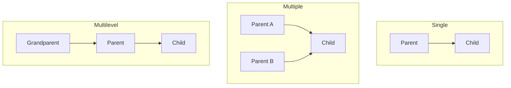

# Python OOP Interview Guide (Accenture Preparation)

This guide covers the **15 Object-Oriented Programming (OOP) questions** from your Accenture preparation screenshot, followed by **4 additional high-yield OOP concepts** frequently tested in technical rounds.

Each concept contains:
1.  **A Clear Definition & Concept**
2.  **Whiteboard-Ready Python Code**
3.  **"How to Say It in the Interview" Script**

---

# Part 1: The 15 Questions From the Image

## 1. What is Object-Oriented Programming (OOP)?
OOP is a programming paradigm that organizes software design around **data (objects)** rather than functions or logic. 
*   **Class:** A blueprint or template for creating objects.
*   **Object:** A real-world entity (an instance of a class) that has **state** (attributes/variables) and **behavior** (methods/functions).

### Code Example
```python
# Class (Blueprint)
class Car:
    def __init__(self, brand):
        self.brand = brand  # State/Attribute

    def drive(self):
        print(f"{self.brand} is driving...")  # Behavior/Method

# Object (Instance)
my_car = Car("Tesla")
my_car.drive()
```

> [!TIP]
> **How to explain to the interviewer:**
> *"OOP is a programming methodology based on Classes and Objects. A Class is a blueprint that defines attributes and behaviors, while an Object is a physical instance of that class. OOP helps make code modular, reusable, and easy to maintain by mapping real-world entities directly into software."*

---

## 2. Explain the Four Pillars of OOP
The four pillars are the foundation of OOP:
1.  **Inheritance:** Reusing code from an existing class to build a new class.
2.  **Polymorphic (Polymorphism):** Performing a single action in different ways (e.g., same method name, different behavior).
3.  **Encapsulation:** Hiding the internal state of an object and restricting direct access by wrapping data and methods into a single unit.
4.  **Abstraction:** Hiding complex implementation details and showing only the essential features to the user.

> [!TIP]
> **How to explain to the interviewer:**
> *"The four pillars of OOP are Inheritance for code reuse, Polymorphism for interface flexibility, Encapsulation for data security and hiding implementation details, and Abstraction to simplify complex architectures by exposing only essential features."*

---

## 3. Difference Between Abstraction and Encapsulation

| Feature | Abstraction | Encapsulation |
| :--- | :--- | :--- |
| **Focus** | **What** the object does (focus on interface, hide complexity). | **How** the object does it (focus on data hiding and security). |
| **Implementation** | Achieved using **Abstract Classes** and **Interfaces** (via the `abc` module). | Achieved using **Access Specifiers** (private variable prefix `__`). |
| **Design Level** | Happens at the **Design level** (high-level planning). | Happens at the **Implementation level** (coding level). |
| **Analogy** | Driving a car: You know pressing the accelerator moves it, but you don't need to know how the engine functions. | The inner components of the car's engine are covered and protected under the hood. |

### Code Example
```python
# Abstraction: Exposing only the interface
from abc import ABC, abstractmethod

class Vehicle(ABC):
    @abstractmethod
    def start_engine(self):
        pass

# Encapsulation: Hiding data using private variables
class BankAccount:
    def __init__(self, owner, balance):
        self.owner = owner
        self.__balance = balance  # Private attribute

    def get_balance(self):  # Getter method
        return self.__balance
```

> [!TIP]
> **How to explain to the interviewer:**
> *"Abstraction hides unnecessary complexity by showing only 'what' an object does (using interfaces). Encapsulation hides the inner data of an object from direct outside access using private modifiers, exposing it only through secure getter and setter methods."*

---

## 4. What is Inheritance?
Inheritance is the mechanism by which a **child class (subclass)** inherits attributes and methods from a **parent class (superclass)**. It promotes **code reusability** and represents an **"IS-A"** relationship (e.g., a Dog *is a* Mammal).

### Code Example
```python
class Animal:
    def eat(self):
        print("Eating...")

class Dog(Animal):  # Dog inherits from Animal
    def bark(self):
        print("Barking...")

dog = Dog()
dog.eat()   # Inherited method
dog.bark()  # Child's own method
```

> [!TIP]
> **How to explain to the interviewer:**
> *"Inheritance is a way to create a new class using details from an existing class. The new class, called the child class, inherits the properties and methods of the parent class, helping us avoid duplicate code."*

---

## 5. Types of Inheritance in Python
Python supports **5 types of inheritance**:

1.  **Single Inheritance:** Child inherits from one parent. (`A -> B`)
2.  **Multiple Inheritance:** Child inherits from more than one parent. (`A & B -> C`)
3.  **Multilevel Inheritance:** Child inherits from a parent which is also a child. (`A -> B -> C`)
4.  **Hierarchical Inheritance:** Multiple children inherit from one parent. (`A -> B` and `A -> C`)
5.  **Hybrid Inheritance:** A combination of two or more types of inheritance.



> [!TIP]
> **How to explain to the interviewer:**
> *"Python supports five types of inheritance: Single, Multiple, Multilevel, Hierarchical, and Hybrid. Unlike Java, Python natively supports Multiple Inheritance where a single child class can have multiple direct parents."*

---

## 6. Method Overloading vs. Method Overriding

### Quick Comparison

| Feature | Method Overloading | Method Overriding |
| :--- | :--- | :--- |
| **Definition** | Multiple methods in the **same class** with the same name but different parameters. | A method in a **child class** that has the same name and signature as a method in the parent class. |
| **Purpose** | To call the same function with different arguments. | To change/customize the behavior of a parent method. |
| **Python Support** | **Not natively supported** by writing multiple identical function names. The last one defined overwrites the rest. We must use default parameters or `*args`. | **Fully supported** natively. |

### Code Example
```python
# Overloading (Python Workaround)
class Calculator:
    def add(self, a, b, c=0):  # Using default parameters
        return a + b + c

# Overriding
class Parent:
    def show(self):
        print("Parent's show")

class Child(Parent):
    def show(self):  # Overrides Parent's show
        print("Child's customized show")
```

> [!TIP]
> **How to explain to the interviewer:**
> *"Method Overloading happens within the same class where multiple methods share a name but have different parameters. Python doesn't natively support overloading by redefining methods, so we use default arguments instead. Method Overriding happens when a child class provides a custom implementation of a method already defined in its parent class."*

---

## 7. Constructor (`__init__`)
In Python, a constructor is a special dunder (double underscore) method named `__init__`. It runs **automatically** when a new object of a class is created. Its main purpose is to initialize the attributes of the object.

### Code Example
```python
class Employee:
    def __init__(self, name):
        self.name = name  # Initializing the object attribute
```

> [!TIP]
> **How to explain to the interviewer:**
> *"The `__init__` method is the constructor in Python. When we instantiate an object, Python automatically calls `__init__` to assign values to the object's properties or run any startup configuration needed for that object."*

---

## 8. What is `self`?
`self` represents the **current instance (object)** of the class. It binds the attributes and methods with the specific object that is calling them.
*   Note: `self` is not a Python keyword; it is a strong convention. You could name it `this` or `me`, but you should always use `self` for readability.

### Code Example
```python
class Student:
    def __init__(self, name):
        self.name = name  # Binds 'name' to this specific object instance
```

> [!TIP]
> **How to explain to the interviewer:**
> *"In Python, `self` is a reference to the current instance of the class. Since class methods can be called by multiple objects, `self` ensures Python knows which specific object's attributes and methods are being accessed or modified."*

---

## 9. Static Method vs. Class Method

| Feature | Class Method | Static Method |
| :--- | :--- | :--- |
| **Decorator** | `@classmethod` | `@staticmethod` |
| **First Parameter** | Takes class reference (`cls`) as the first argument. | Does not take any implicit first argument (neither `self` nor `cls`). |
| **Access** | Can access/modify class state (attributes starting with `cls.`). | Cannot access or modify class or instance states. |
| **Use Case** | Used as **factory methods** to create modified class instances. | Used as **utility functions** that logically belong inside the class namespace. |

### Code Example
```python
class Employee:
    company = "Accenture"

    def __init__(self, name):
        self.name = name

    @classmethod
    def change_company(cls, new_name):
        cls.company = new_name  # Modifies class state

    @staticmethod
    def is_work_day(day):
        return day not in ["Saturday", "Sunday"]  # Independent utility
```

> [!TIP]
> **How to explain to the interviewer:**
> *"A class method takes `cls` as its first parameter and can access or modify class-level variables; they are often used to build factory patterns. A static method does not take any class or instance parameters; it behaves like a regular function grouped inside the class for logical organization."*

---

## 10. What is Polymorphism?
Polymorphism literally means "many forms". It refers to the ability of different classes to have methods with the **same name but different behaviors**.

### Code Example
```python
class Bird:
    def fly(self):
        print("Most birds can fly.")

class Penguin(Bird):
    def fly(self):  # Polymorphism through overriding
        print("Penguins cannot fly; they swim.")
```

> [!TIP]
> **How to explain to the interviewer:**
> *"Polymorphism is the ability of different objects to respond to the same method call in their own way. For example, if we have a list of animal objects and call `.speak()` on each, a Dog barks while a Cat meows, using the same method name to trigger different behaviors."*

---

## 11. What is Composition?
Composition is a design principle where a class contains references to objects of other classes as its attributes. It represents a **"HAS-A"** relationship (e.g., a Car *has an* Engine).
*   **Composition vs Inheritance:** Prefer composition over inheritance. Inheritance makes code rigid (tight coupling), whereas composition keeps it flexible (loose coupling).

### Code Example
```python
class Engine:
    def start(self):
        return "Engine started."

class Car:
    def __init__(self):
        self.engine = Engine()  # Car HAS AN Engine (Composition)

    def start_car(self):
        return self.engine.start()
```

> [!TIP]
> **How to explain to the interviewer:**
> *"Composition is a design technique where one class is built using instances of other classes. It models a 'HAS-A' relationship. It is generally preferred over inheritance because it keeps classes loosely coupled, making it easier to change components without breaking the hierarchy."*

---

## 12. What is `super()`?
`super()` is a built-in function that returns a proxy object, allowing you to call methods of the parent class inside a child class. Its primary use case is calling the parent constructor (`__init__`) inside the child's constructor.

### Code Example
```python
class Parent:
    def __init__(self, name):
        self.name = name

class Child(Parent):
    def __init__(self, name, school):
        super().__init__(name)  # Calls Parent's constructor
        self.school = school
```

> [!TIP]
> **How to explain to the interviewer:**
> *"We use `super()` to refer to the parent class of a child class. It allows us to invoke parent methods and constructors, ensuring that parent initialization logic is run properly when we create subclass instances."*

---

## 13. Can Python Support Multiple Inheritance?
**Yes**, Python natively supports multiple inheritance. A child class can inherit from multiple parent classes.
*   **The Challenge (Diamond Problem):** If Class A is inherited by B and C, and Class D inherits from both B and C, which parent class constructor runs first?
*   **The Solution:** Python uses **MRO (Method Resolution Order)** calculated using the **C3 Linearization algorithm** to resolve the sequence of execution.

### Code Example
```python
class ParentA:
    def speak(self):
        print("Speaking in A")

class ParentB:
    def speak(self):
        print("Speaking in B")

class Child(ParentA, ParentB):
    pass

c = Child()
c.speak()  # Output: "Speaking in A" (ParentA takes priority based on order in declaration)
print(Child.__mro__)
```

> [!TIP]
> **How to explain to the interviewer:**
> *"Yes, Python supports multiple inheritance. It resolves method name conflicts (the Diamond Problem) using Method Resolution Order (MRO), which scans classes from left to right, depth-first, without repeating parent lookups."*

---

## 14. What is an Abstract Class?
An abstract class is a template or contract that contains one or more **abstract methods** (methods declared but without implementation). 
*   **Rules:** You cannot instantiate (create an object of) an abstract class. Child classes must implement all abstract methods to be instantiated.
*   **Implementation:** Done using Python's built-in `abc` (Abstract Base Classes) module.

### Code Example
```python
from abc import ABC, abstractmethod

class Payment(ABC):  # Abstract Class
    @abstractmethod
    def process_payment(self, amount):
        pass

class CreditCardPayment(Payment):
    def process_payment(self, amount):  # Child MUST implement this
        print(f"Processing credit card payment of ${amount}")
```

> [!TIP]
> **How to explain to the interviewer:**
> *"An abstract class acts as a template for other classes. It defines abstract methods that subclasses must implement. In Python, we define them by inheriting from the `ABC` class in the `abc` module and using the `@abstractmethod` decorator."*

---

## 15. Explain a Real-Time OOP Example
A great real-world example is an **E-Commerce Checkout System**.

*   **Abstraction:** We define an abstract class `PaymentGateway` with a method `pay()`. The user does not care how the bank servers communicate; they only call the `pay()` interface.
*   **Inheritance:** We create child classes like `PayPalPayment` and `StripePayment` inheriting from `PaymentGateway`.
*   **Polymorphism:** The cart checkout function takes a generic `PaymentGateway` object and calls `.pay()`. If it is PayPal, it redirects to the browser; if it is Stripe, it processes credit cards.
*   **Encapsulation:** The `Customer` class hides sensitive data like `__credit_card_pin` as private variables, allowing updates only via validated methods.

---
---

# Part 2: Additional Crucial Python OOP Concepts

These four topics are highly asked by interviewers looking to test advanced Python developers.

## 16. Access Specifiers in Python (Private Variables)
Unlike C++ or Java, Python does not have strict keyword boundaries like `public`, `protected`, or `private`. Instead, it uses **naming conventions**:

1.  **Public:** No prefix. Access is unrestricted. (e.g., `self.brand`)
2.  **Protected:** Single underscore prefix (`_`). Suggests the variable is intended for internal/subclass use only. Access is still technically possible from outside. (e.g., `self._model`)
3.  **Private:** Double underscore prefix (`__`). Triggers **Name Mangling**. The interpreter renames the attribute to `_ClassName__attributeName` to prevent accidental direct access.

### Code Example
```python
class Secret:
    def __init__(self):
        self.public_val = 1
        self._protected_val = 2
        self.__private_val = 3  # Private variable

s = Secret()
print(s.public_val)       # Works
print(s._protected_val)   # Works (but discouraged by PEP 8)
# print(s.__private_val)  # Raises AttributeError!

# Accessing via name mangling (proving it is not strictly locked):
print(s._Secret__private_val)  # Works!
```

> [!TIP]
> **How to explain to the interviewer:**
> *"Python does not enforce true private variables. Instead, it relies on conventions. A single underscore indicates a protected variable, and a double underscore triggers 'Name Mangling', where Python renames the variable under the hood to prevent accidental access. You can still access it using `_ClassName__variableName`."*

---

## 17. Magic / Dunder Methods
Magic methods are special methods with **double underscores** (dunder) before and after their names. They allow you to define how your custom objects behave with built-in Python operators (like `+`, `-`, `len()`, `str()`).

### Common Magic Methods
*   `__str__(self)`: Defines user-friendly string representation when using `print(obj)`.
*   `__repr__(self)`: Defines developer-oriented representation (fallback for `__str__`).
*   `__add__(self, other)`: Overloads the `+` operator.

### Code Example
```python
class Book:
    def __init__(self, title, pages):
        self.title = title
        self.pages = pages

    def __str__(self):
        return f"'{self.title}' ({self.pages} pages)"

    def __len__(self):
        return self.pages

my_book = Book("Python 101", 300)
print(my_book)  # Prints: 'Python 101' (300 pages) -> Triggered by __str__
print(len(my_book))  # Prints: 300 -> Triggered by __len__
```

> [!TIP]
> **How to explain to the interviewer:**
> *"Dunder methods allow us to implement operator overloading in Python. They let our custom classes interact seamlessly with Python's built-in actions, such as converting an object to a string with `__str__` or finding its size using `__len__`."*

---

## 18. `__new__` vs `__init__`
In Python, object creation is a two-step process:

1.  **`__new__` (Object Creator):** The actual creator method. It is a static method that allocates memory and returns a new blank instance of the class.
2.  **`__init__` (Object Initializer):** Receives the instance returned by `__new__` and initializes its attributes.

### Code Example
```python
class Demo:
    def __new__(cls, *args, **kwargs):
        print("1. __new__ creates the object in memory")
        return super().__new__(cls)

    def __init__(self):
        print("2. __init__ initializes the object details")

d = Demo()
```

> [!TIP]
> **How to explain to the interviewer:**
> *"The main difference is that `__new__` is responsible for creating the object and returning its instance, whereas `__init__` is responsible for initializing that instance once it has been created. We rarely override `__new__`, except when creating subclasses of immutable classes or building singletons."*

---

## 19. Method Resolution Order (MRO)
MRO represents the order in which Python searches for inherited methods or attributes when dealing with multiple inheritance. 

*   Python uses the **C3 Linearization** algorithm to compute MRO.
*   **Rules:** Python resolves classes left-to-right, depth-first, ensuring that no base class is visited before its subclasses.
*   You can inspect MRO on any class using `ClassName.__mro__` or `ClassName.mro()`.

```python
class A: pass
class B(A): pass
class C(A): pass
class D(B, C): pass

print(D.mro())
# Output: [D, B, C, A, object]
```
