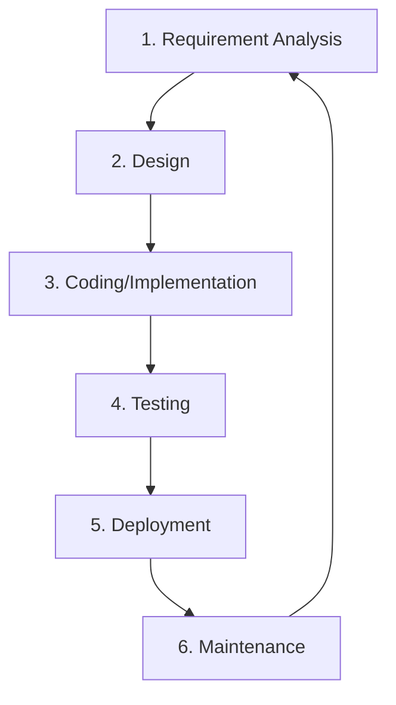
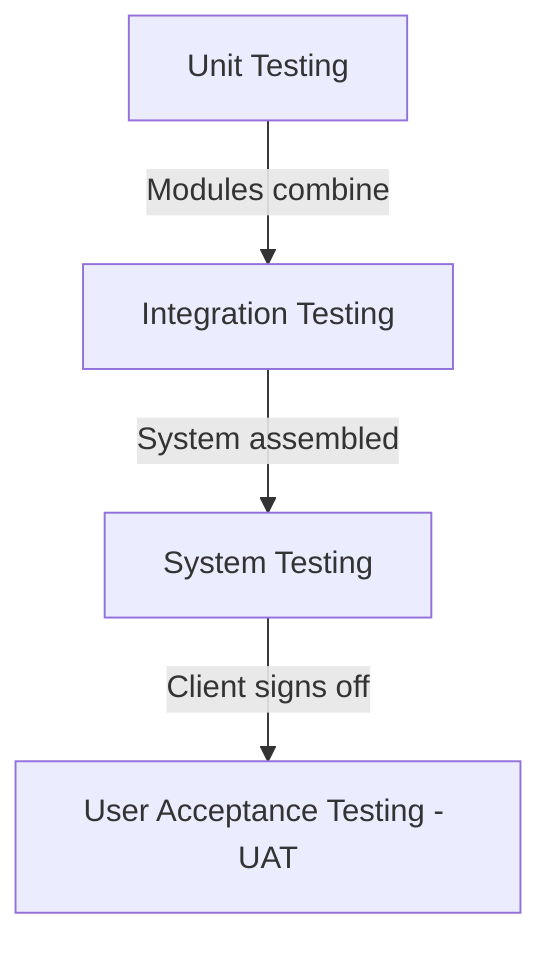

# Day 05: SDLC, Agile & Testing Guide

This study guide prepares you for questions on **Software Development Life Cycle (SDLC)**, **Agile/Scrum**, and **Software Testing** – key topics in Accenture's Custom Software Engineering interviews.

---

## 1. SDLC: Software Development Life Cycle

The **SDLC** is a structured process used by software teams to design, develop, test, and deploy high-quality software.



### The 6 Core Phases:
1. **Requirement Analysis:** Gathering user expectations, business needs, and technical requirements. (Led by Product Owners/Business Analysts).
2. **Design:** Creating architectural blueprints, system workflows, database models (ERDs), and technology stack selection.
3. **Coding/Implementation:** Developers write clean, modular source code according to the design specifications.
4. **Testing:** Verifying the software against requirements to identify bugs, performance bottlenecks, and security gaps.
5. **Deployment:** Releasing the application to environment stages (Staging/Production) for actual user consumption.
6. **Maintenance:** Monitoring the system, addressing post-release bugs, and applying updates or security patches.

---

## 2. Agile vs. Waterfall Methodology

| Feature | Waterfall (Traditional) | Agile (Modern) |
| :--- | :--- | :--- |
| **Approach** | Linear and sequential. One phase must finish before the next begins. | Iterative and incremental. Development is done in small cycles (sprints). |
| **Requirements** | Defined and frozen at the very beginning. Changes are highly expensive. | Dynamic and flexible. Welcomes changes even late in development. |
| **Customer Feedback**| Only at the very end of the lifecycle (during UAT / post-deployment). | Continuous feedback at the end of every sprint (typically 1–4 weeks). |
| **Risk of Failure** | High. If requirements were misunderstood, it is realized too late. | Low. Issues are identified and rectified early in small cycles. |
| **Best suited for** | Projects with fixed budgets, static requirements, and known technology. | Dynamic environments, startup products, and evolving user feedback. |

---

## 3. Scrum Framework: Roles & Meetings

Scrum is the most popular framework for implementing Agile. It operates in fixed-length iterations called **Sprints** (usually 2 weeks).

### Scrum Roles:
*   **Product Owner (PO):** Represents the customer/business. Owns the **Product Backlog**, prioritizes features, and defines user requirements (User Stories).
*   **Scrum Master (SM):** Facilitates the team. Removes blockers (impediments), coaches the team on Scrum values, and protects the developers from external interruptions.
*   **Developers/Development Team:** Cross-functional professionals who commit to building and delivering a usable software increment at the end of each Sprint.

### Scrum Ceremonies (Meetings):
1. **Sprint Planning:** Held at the start of a Sprint. The team pulls high-priority items from the Product Backlog, estimates them, and defines the **Sprint Backlog** and the **Sprint Goal**.
2. **Daily Stand-up (Daily Scrum):** A brief, 15-minute daily sync. Each member answers:
    *   *What did I do yesterday?*
    *   *What am I doing today?*
    *   *Are there any blockers/impediments in my way?*
3. **Sprint Review:** Held at the end of the Sprint. The team demonstrates the working software increment to stakeholders for feedback.
4. **Sprint Retrospective:** Held after the Review and before the next Sprint Planning. The team reflects internally to improve the process:
    *   *What went well?*
    *   *What went wrong?*
    *   *How can we improve in the next Sprint?*

---

## 4. Requirements & Backlogs

*   **Product Backlog:** A living, prioritized list of all features, enhancements, bug fixes, and technical requirements needed for the product. Owned by the Product Owner.
*   **Sprint Backlog:** A subset of items selected from the Product Backlog for execution in the current Sprint. Owned by the Developers and remains **frozen** during the Sprint (changes shouldn't be made mid-sprint).
*   **User Stories:** A simple way to write requirements from a user’s perspective.
    *   **Format:** `"As a [type of user], I want to [perform some action] so that [obtain some value/benefit]."`
    *   *Example:* *"As a registered customer, I want to filter products by price so that I can find items within my budget quickly."*
    *   **Acceptance Criteria:** Concrete boundaries and conditions that a user story must satisfy to be declared "Done" (e.g., "The filter list must load in under 1 second").

---

## 5. Levels of Testing

Testing is performed at different stages to ensure quality from lines of code up to the complete system.



1. **Unit Testing:** Tests individual functions, methods, or classes in isolation. Usually written and executed by developers. External dependencies (like databases or APIs) are **mocked**.
2. **Integration Testing:** Tests the communication flow and data exchange between two or more modules (e.g., verifying that a Python backend retrieves correct data from a PostgreSQL database).
3. **System Testing:** End-to-end testing of the complete, fully integrated software system to ensure it meets all functional and non-functional requirements.
4. **User Acceptance Testing (UAT):** Performed by the client or end-users to verify that the software meets business needs before it goes live into production.

---

## 6. Testing Types by Scope

| Testing Type | Scope & Purpose | Metaphorical Example |
| :--- | :--- | :--- |
| **Smoke Testing** | **Broad but Shallow.** Run immediately after a new build is deployed to check if the application's critical features are stable enough to proceed with deeper testing. If it fails, the build is rejected. | *Turn the ignition key of a car. If smoke comes out of the engine, do not attempt to drive or inspect the brakes.* |
| **Sanity Testing** | **Narrow but Deep.** Conducted after receiving a new software build with minor changes (like a quick bug fix) to verify that the specific modified features work as expected. | *After replacing a broken headlight in a car, you turn on the switch to confirm that the specific headlight now lights up.* |
| **Regression Testing**| **Full Verification.** Running existing tests on unchanged parts of the application to ensure that recent code modifications or bug fixes have not broken pre-existing functionality. | *After repairing the engine, you test the brakes, steering, air conditioning, and windows to ensure the engine repair didn't break them.* |

---

## 7. Black Box vs. White Box Testing

### Black Box Testing:
*   The tester has **no knowledge** of the internal code, structure, or implementation details of the application.
*   Focuses purely on testing the inputs and validating the outputs against expected requirements.
*   *Techniques:* Boundary Value Analysis (BVA), Equivalence Partitioning.

### White Box Testing:
*   The tester has **full access and knowledge** of the internal code structure, control flows, and implementation.
*   Focuses on testing loops, statements, branches, and execution paths.
*   *Examples:* Code coverage testing, Unit testing.

---

## 8. Assertions and Common Debugging Techniques

### Assertions in Python
An **assertion** is a sanity check that you can turn on or off during testing. If the assertion expression evaluates to `True`, the program continues. If it evaluates to `False`, Python raises an `AssertionError`.

*   **Syntax:** `assert expression, "Optional error message if assertion fails"`
*   **Code Example:**
    ```python
    def calculate_discount(price, discount):
        assert price >= 0, "Price cannot be negative"
        assert 0 <= discount <= 100, "Discount must be a percentage between 0 and 100"
        return price * (1 - discount / 100)

    # test_discount.py
    def test_calculate_discount():
        # Happy Path
        assert calculate_discount(100, 10) == 90.0
        
        # Edge Case
        assert calculate_discount(0, 50) == 0.0
    ```

### Common Debugging Techniques:
1. **Print/Logging Debugging:** Inserting print statements or configuring the Python `logging` module to track variable states and execution flows.
2. **Interactive Debugger (`pdb` in Python):**
   * Insert `import pdb; pdb.set_trace()` or the modern built-in function `breakpoint()` in your code.
   * Execution stops at that line, opening an interactive prompt where you can step through lines (`n`), inspect variables (`p`), or continue (`c`).
3. **Rubber Duck Debugging:** Verbally explaining your code line-by-line to an inanimate object (like a rubber duck). This forces you to think through the logic step-by-step, which often reveals the bug.
4. **Dry Run (Trace Table):** Manually tracing the code's execution on paper, listing each variable's value at every step of a loop to verify logic.
