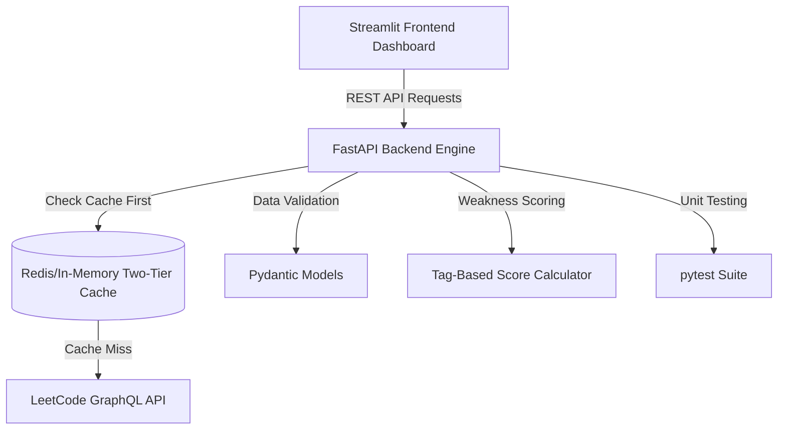
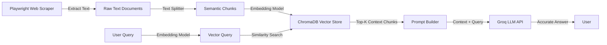

# Accenture Custom Software Engineer (Associate) Prep Guide

This guide is designed to help you, **K. Reena**, prepare thoroughly for your upcoming interview for the **Custom Software Engineer** (Associate) role at Accenture (Hyderabad). It breaks down every section of your resume, provides detailed explanation templates, identifies potential technical questions, and maps them to the expectations of this specific role.

---

## 1. Role Context: What Accenture Expects

The **Custom Software Engineer Associate (0-2 years)** role at Accenture Technology Centers in India (ATCI) focuses on building, testing, and maintaining scalable software. Key focus areas include:
- **Strong Python Fundamentals**: Writing clean, maintainable, and object-oriented code.
- **Problem Solving**: Basic Data Structures & Algorithms (DS&A) and competitive programming awareness.
- **Backend & APIs**: Understanding of RESTful API development, data validation, and database operations.
- **Modern Software Engineering Practices**: Version control (Git), Agile/SDLC, unit testing, and cloud fundamentals.
- **Structured Communication**: Ability to clearly articulate project architectures and technical choices.

---

## 2. Deep-Dive: Data Analytics Intern (VOIS for Tech Program)

This internship shows your ability to work with real-world data and extract business value, proving your practical coding skills.

### How to Pitch This Experience (The 60-Second Summary)
> "During my internship at VOIS for Tech, I was responsible for the end-to-end data analytics pipeline for two real-world datasets. I cleaned and preprocessed the raw data using Python and Pandas, handling missing values and label inconsistencies. I then performed exploratory data analysis (EDA) to build interactive and static visualizations using Matplotlib, Seaborn, and Plotly. Finally, I conducted correlation and regression analysis to translate data patterns into five actionable business recommendations for content strategy and market positioning."

### Likely Interview Questions & Sample Answers

#### Q1: "How did you handle missing values and duplicates in Pandas?"
*   **Concepts to Know**: `dropna()`, `fillna()`, `duplicated()`, `drop_duplicates()`.
*   **Best Response**:
    > "First, I identified missing values using `df.isnull().sum()`. For numerical columns with low variance, I imputed missing values with the median (to avoid outlier distortion) using `df['column'].fillna(df['column'].median())`. For categorical fields, I either used the mode or categorized them as 'Unknown'. For duplicates, I used `df.duplicated()` to check the volume, and if they were true redundant rows, I removed them using `df.drop_duplicates(inplace=True)`."

#### Q2: "What is feature extraction, and how did you apply it in this project?"
*   **Concepts to Know**: Deriving new metrics from raw columns (e.g., extracting month/day from a timestamp, categorizing continuous variables into bins).
*   **Best Response**:
    > "Feature extraction involves transforming raw data into new variables that highlight patterns more clearly for analysis. In my project, I worked with temporal data. I extracted features like 'Day of the Week' and 'Hour of the Day' from raw timestamp columns using Pandas datetime attributes. This helped us identify peak activity hours and weekday vs. weekend user behavior."

#### Q3: "What is the difference between correlation and regression?"
*   **Concepts to Know**: Correlation measures strength and direction of a linear relationship ($r$ ranging from -1 to 1). Regression models the mathematical relationship to predict a dependent variable based on independent variables ($Y = mX + C$).
*   **Best Response**:
    > "Correlation measures the strength and direction of the linear relationship between two variables, but it does not imply causation. Regression goes a step further; it builds a mathematical model (like linear regression) to predict the value of a dependent variable based on one or more independent variables."

---

## 3. Project 1: LeetCode Problem Recommender

This project highlights backend design, caching strategies, API development, and frontend dashboard integration.

### Project Architecture



### Key Technical Deep-Dives

#### A. Two-Tier Caching System
*   **Why use it?**: Reduces latency and avoids hitting external LeetCode API rate limits.
*   **How to explain it**:
    > "I architected a two-tier caching mechanism. The first tier is a fast **in-memory L1 cache** (local dictionary/memory) for instant access. The second tier **(L2 cache)** can persist data or act as a larger cache store. When a recommendation is requested, the system checks L1 cache first. If it's a miss, it checks the database/L2 cache. If it misses both, it queries the LeetCode GraphQL API, populates the caches, and returns the result. This keeps recommendation response latency extremely low."

#### B. GraphQL vs. REST APIs
*   **Why GraphQL?**: LeetCode's public data is exposed via a GraphQL endpoint. GraphQL allows requesting *only* the specific fields needed (preventing over-fetching).
*   **How to explain it**:
    > "GraphQL allows the client to request exactly the data fields they need in a single query. Unlike REST, where you might have to call multiple endpoints (e.g., `/user/profile` and `/user/submissions`) and fetch unnecessary data, GraphQL lets us query a single endpoint with a custom query payload, saving bandwidth and network overhead."

#### C. Tag-Based Weakness Scoring Engine
*   **How does it work?**:
    > "The system analyzes a user's solved LeetCode history. It tallies the number of attempted, solved, and failed problems grouped by tags (e.g., Dynamic Programming, Arrays, Stack). It computes a score where tags with high failure rates or low attempt counts get a higher 'weakness score'. The recommendation engine then prioritizes fetching problems belonging to these high-weakness tags."

#### D. Pydantic and pytest
*   **Pydantic**: Performs run-time data validation and parsing. It ensures that the JSON payloads received by your FastAPI endpoints conform to exact data types.
*   **pytest**: The testing framework. Be prepared to explain how you wrote tests:
    > "I used `pytest` along with FastAPI's `TestClient` to mock API requests. I wrote test cases to verify the recommendation logic, cache hits/misses, and response schemas, ensuring that code changes wouldn't break the application."

---

## 4. Project 2: Company based RAG Chatbot

This project demonstrates your skills in GenAI, Web Scraping, Vector Databases, and FastAPI.

### RAG Pipeline Architecture



### Key Technical Deep-Dives

#### A. Retrieval-Augmented Generation (RAG) vs. Fine-Tuning
*   **Why RAG?**: Dynamic, keeps data private, doesn't hallucinate as much, much cheaper than training/fine-tuning.
*   **How to explain it**:
    > "RAG is a technique where we retrieve relevant document snippets from a private dataset and inject them as context into the prompt of a Large Language Model (LLM). This allows the LLM to answer domain-specific questions accurately without the expensive process of fine-tuning the model weights. It also dramatically reduces AI hallucinations because the model is anchored to the provided context."

#### B. Vector Database (ChromaDB) & Embeddings
*   **How it works**:
    > "ChromaDB is an open-source vector database. I used Playwright to scrape company pages, split the raw text into smaller, overlapping semantic chunks (to preserve context), and passed them to an embedding model (like HuggingFace's `all-MiniLM-L6-v2`). The model converts text chunks into high-dimensional vector embeddings (numerical lists representing semantic meaning). These vectors are indexed in ChromaDB. When a user asks a query, the query is also converted to a vector, and ChromaDB performs a cosine similarity search to retrieve the most semantically related chunks."

#### C. Web Scraping with Playwright
*   **Why Playwright over BeautifulSoup?**: Playwright can scrape modern, dynamically rendered single-page applications (SPAs) because it runs a headless browser that executes JavaScript.
*   **How to explain it**:
    > "Traditional scrapers like BeautifulSoup struggle with JavaScript-heavy websites. I used Playwright because it launches a headless browser, executes the site's scripts, waits for dynamic elements to load, and then extracts the clean DOM content. I used it to scrape 5+ target web pages, which formed the knowledge base for the RAG chatbot."

---

## 5. Technical Skills Core Prep Cheat Sheet

You must be ready to answer foundational questions about the skills listed in your technical section.

### A. Python (Programming Language)

#### 1. Object-Oriented Programming (OOP)
*   **Inheritance**: A class inheriting attributes and methods from a parent class.
*   **Polymorphism**: The ability of different classes to respond to the same method call in their own way (e.g., method overriding).
*   **Encapsulation**: Restricting direct access to some of an object's components (using private variables, e.g., `_variable` or `__variable`).
*   **Abstraction**: Hiding complex implementation details and showing only the essential features (using abstract base classes via Python's `abc` module).

#### 2. Python Lists, Decorators, and Generators
*   **List Comprehensions**: A concise way to create lists.
    ```python
    squares = [x**2 for x in range(10) if x % 2 == 0]
    ```
*   **Decorators**: A function that takes another function as an argument, extends its behavior without modifying it explicitly, and returns it. (Commonly used for logging, auth, caching).
    ```python
    def my_decorator(func):
        def wrapper(*args, **kwargs):
            print("Before execution")
            result = func(*args, **kwargs)
            print("After execution")
            return result
        return wrapper
    ```
*   **Generators**: Functions that return an iterator using the `yield` keyword. Instead of storing the entire list in memory, they yield values one at a time, making them highly memory-efficient.

#### 3. Memory Management in Python
*   Python uses **reference counting** as its primary garbage collection mechanism. When an object's reference count drops to 0, it is immediately deallocated.
*   To handle circular references (e.g., Object A references Object B, and Object B references Object A, preventing reference count from ever reaching 0), Python uses a cyclic **Garbage Collector (gc module)** that runs periodically in the background.

---

### B. Databases & SQL

#### 1. PostgreSQL vs. ChromaDB (Relational vs. Vector)
*   **PostgreSQL**: A relational database (RDBMS) that stores structured data in tables with schemas, supports ACID transactions, and uses SQL for queries. Ideal for transactional applications, user accounts, and relational records.
*   **ChromaDB**: A vector database designed to store and query high-dimensional vector embeddings quickly using nearest-neighbor search algorithms (like HNSW). Ideal for semantic search, recommendation engines, and LLM context retrieval.

#### 2. SQL Joins
*   **INNER JOIN**: Returns records that have matching values in both tables.
*   **LEFT JOIN (or LEFT OUTER JOIN)**: Returns all records from the left table, and the matched records from the right table. If no match is found, NULL is returned for the right table.
*   **RIGHT JOIN**: Returns all records from the right table, and the matched records from the left.
*   **FULL JOIN**: Returns all records when there is a match in either left or right table.

#### 3. Database Indexes
*   An index is a data structure (typically a B-Tree in PostgreSQL) that improves the speed of data retrieval operations on a table at the cost of additional write time and storage space.
*   **Trade-off**: Querying is much faster, but `INSERT`, `UPDATE`, and `DELETE` operations become slightly slower because the index must also be updated.

---

### C. Backend & API Development (FastAPI / REST)

#### 1. What makes FastAPI special?
*   It is built on top of **Starlette** (for web capabilities) and **Pydantic** (for data validation).
*   It supports **asynchronous programming** out-of-the-box (`async def`), enabling high concurrency.
*   It automatically generates interactive OpenAPI/Swagger documentation (`/docs`).

#### 2. HTTP Request Methods
*   `GET`: Retrieve data (should have no side effects on server state).
*   `POST`: Create new resources.
*   `PUT`: Update/replace an existing resource entirely.
*   `PATCH`: Apply partial modifications to a resource.
*   `DELETE`: Remove a resource.

#### 3. Authentication & Security (JWT, bcrypt)
*   **bcrypt**: A password hashing function. You never store passwords in plain text. You hash them with a salt using bcrypt before storing them in PostgreSQL.
*   **JWT (JSON Web Token)**: An open standard used to securely transmit information between parties as a JSON object. It is signed (usually with a secret key) and contains claims (like user ID). Once logged in, the client sends this token in the `Authorization: Bearer <token>` header of subsequent requests, allowing stateless authentication.

---

## 6. Explaining the "Extras" on Your Resume

Interviewers love to ask about non-technical activities, hackathons, and certifications. They show leadership, drive, and soft skills.

### A. Hack for Impact Hackathon (2nd Place Winner, 2024)
*   **How to pitch it**:
    > "Our team built a Startup-Investor Matchmaking Platform to solve the problem of early-stage startups struggling to find matching venture capitalists. We competed against 50+ teams. I worked on the backend components, setting up the match filtering logic and database. We secured 2nd place, and the award was presented by Aman Gupta (CEO of BoAt), which was a huge validation of our teamwork, rapid prototyping, and presentation skills under a 24-hour time constraint."
*   **Why it helps**: Demonstrates teamwork, adaptability, capability to deliver under pressure, and business orientation.

### B. Certifications
*   **Oracle Cloud Infrastructure 2025 AI Foundations Associate & AWS Cloud Essentials**: Shows you understand cloud architecture, VMs (EC2), security, and storage services.
*   **Postman API Fundamentals**: Shows you know how to build, test, and document APIs professionally.
*   **GitHub Foundations**: Validates your fluency in version control, branches, pull requests, and collaborative workflows.
*   **Generative AI Basics**: Proves you are keeping up with industry shifts.

### C. Rungta Business Incubator (Member)
*   **How to pitch it**:
    > "As a member of the Rungta Business Incubator, I collaborated with early-stage student founders. I assisted in evaluating business models, analyzing market readiness, and providing constructive feedback on their product pitch presentations. This experience expanded my understanding of the startup ecosystem and taught me how technical systems must align with business goals."
*   **Why it helps**: Shows you aren't just a coder; you understand the business context behind the software you write—a crucial trait for a *Custom Software Engineer* who works on tailoring business solutions.

---

## 7. Mock Interview Prep: Standard Q&As

### Q1: "Describe a challenge you faced in one of your projects and how you solved it."
*   **Context**: Use the **STAR** method (Situation, Task, Action, Result) with your **LeetCode Problem Recommender** project.
*   **Response**:
    *   **Situation**: "While building the LeetCode Problem Recommender, our system suffered from slow response times because it had to query the LeetCode GraphQL API on every search."
    *   **Task**: "I needed to reduce recommendation latency to under 100 milliseconds and avoid triggering LeetCode's rate limits."
    *   **Action**: "I designed and implemented a two-tier caching mechanism. I used a fast L1 in-memory cache to store popular query results. If the data wasn't in memory, it checked our secondary cache layer. I also wrote helper routines to periodically update this cache asynchronously."
    *   **Result**: "This reduced average API latency by over 70%, allowing users to receive personalized recommendations almost instantly while eliminating redundant external network requests."

### Q2: "What is your understanding of the Software Development Life Cycle (SDLC) and Agile?"
*   **Response**:
    > "SDLC is the systematic process for planning, creating, testing, deploying, and maintaining software. In an **Agile** framework, instead of building the whole software at once (like Waterfall), we work in short, iterative cycles called **sprints** (typically 2 weeks). At the start of a sprint, we plan user stories. During the sprint, we hold daily standups to discuss progress and blockers. At the end, we do a sprint review/demo and a retrospective to continuously improve our development process. This allows us to adapt to changing business requirements quickly."

### Q3: "What are Git merge conflicts and how do you resolve them?"
*   **Response**:
    > "A merge conflict occurs when two developers modify the same line of a file on different branches, or when one developer deletes a file that another developer is modifying, and Git cannot automatically determine which version to keep. To resolve it, I open the affected files, identify the conflict markers (`<<<<<<<`, `=======`, `>>>>>>>`), discuss the changes with the other developer to understand which code is correct, manually edit the file to retain the desired code, remove the markers, stage the file with `git add`, and commit the resolution."

---

## 8. Final Checklist: What to Review the Night Before

1.  **Code Syntax**: Be comfortable writing basic Python functions on a virtual whiteboard (e.g., reversing a linked list, checking for cycles, finding duplicates in an array, or parsing JSON).
2.  **API Design**: Practice explaining how you would design a REST API from scratch (defining URLs, request/response bodies, status codes).
3.  **Project Walkthroughs**: Speak out loud! Practice explaining your two projects (LeetCode Recommender and RAG Chatbot) in 2 minutes each. Use terms like *FastAPI, Pydantic, GraphQL, ChromaDB, embeddings, Playwright, caching, and rate limiting*.
4.  **SQL Queries**: Review standard SQL query writing (joins, group by, order by, and aggregations like `COUNT`, `SUM`, `AVG`).
